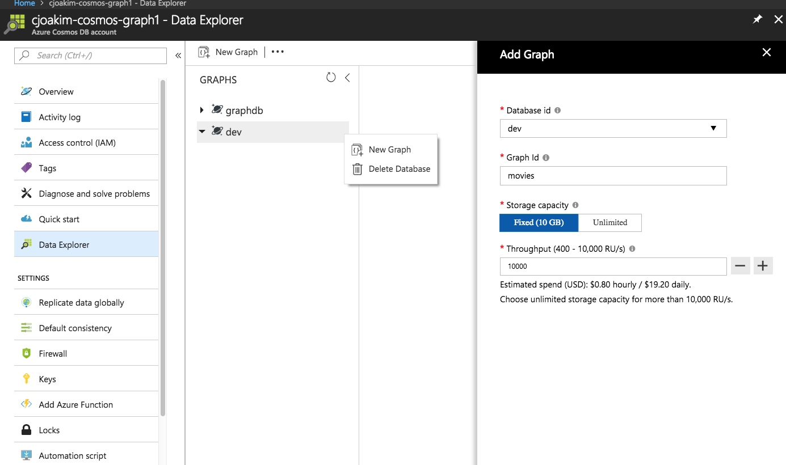

# azure-cosmos-graph

CosmosDB Graph Database example - the N-Degrees of Kevin Bacon (or Julia Roberts or Richard Gere or Diane Lane ...)

Start with the IMDb datasets, wrangle them to a smaller size, load them into
the CosmosDB/GraphDB, and search for the nth degrees of Kevin Bacon and others.

## Six_Degrees_of_Kevin_Bacon

This CosmosDB/GraphDB example was inspired by [this](https://en.wikipedia.org/wiki/Six_Degrees_of_Kevin_Bacon)

> "...in a January 1994 interview with Premiere magazine discussing the film The River Wild, mentioned that "he had worked
> with everybody in Hollywood or someone who’s worked with them."[1] On April 7, 1994, a lengthy newsgroup thread headed
> "Kevin Bacon is the Center of the Universe" appeared.  Four Albright College students: Craig Fass, Christian Gardner,
> Brian Turtle, and Mike Ginelli created the game early in 1994."

It rests on the assumption that anyone involved in the Hollywood film industry can be linked through their film roles to Bacon within six steps.


## CosmosDB Provisioning

In Azure Portal, provision a CosmosDB with the Graph API.

Capture its keys in the Azure Portal, and set these as environment variables to similar values:
```
AZURE_COSMOSDB_GRAPH1_ACCT=cjoakim-cosmos-graph1
AZURE_COSMOSDB_GRAPH1_CONN_STRING=AccountEndpoint=https://cjoakim-cosmos-graph1.documents.azure.com:443/;AccountKey=h2D...Sw==;
AZURE_COSMOSDB_GRAPH1_DBNAME=dev
AZURE_COSMOSDB_GRAPH1_KEY=h2D...Sw==
AZURE_COSMOSDB_GRAPH1_URI=https://cjoakim-cosmos-graph1.documents.azure.com:443/
```

Within the DB account, create database id **dev** with graph id **movies** as shown.
It is recommended that you specify 10,000 RUs.




## This Project

This project contains **both** the data-wrangling logic as well as the end-result data
that you can simply use.

To use the pre-wrangled data skip down to the **Load and Query the DB** section.

### Data Wrangling

The source data for this project is the **Internet Movie Database**.  It contains millions of rows
of data related to Hollywood moves, their actors/participants, and their ratings.

This can be downloaded from here:
- http://www.imdb.com/interfaces/
- https://datasets.imdbws.com

The wrangling logic in this project filters this huge amount of data into a small subset that
is easily loaded into CosmosDB for your exploration.  The wrangling logic is implemented in Python 3.

In short, the wrangling steps are:
- Start with a manually created list of 12 favorite actors (see 'actors_for_candidate_movies' in values.py)
- Extract just the movies for those actors (approx 486 movies)
- Extract the principals (i.e. - actors) for those moves.  Omit directors, producers, stunt men, etc.
- Extract the details for each of the principals


#### IMDb Data

You can download the data from here:

- http://www.imdb.com/interfaces/
- https://datasets.imdbws.com

### Raw Data

This is the list of the downloaded zipped and unzipped files, with their sizes
```
 511846598 Feb 27 10:52 name.basics.tsv
 165971634 Feb 25 05:17 name.basics.tsv.gz
 174443242 Feb 27 10:52 title.akas.tsv
  52330181 Feb 25 05:17 title.akas.tsv.gz
 409681927 Feb 27 10:50 title.basics.tsv
  87696341 Feb 25 05:17 title.basics.tsv.gz
  81236137 Feb 27 10:52 title.episode.tsv
  17665426 Feb 26 05:19 title.episode.tsv.gz
1208052497 Feb 27 10:52 title.principals.tsv
 241072882 Feb 26 05:19 title.principals.tsv.gz
  13764321 Feb 27 10:52 title.ratings.tsv
   3998762 Feb 26 05:19 title.ratings.tsv.gz
```

Also set the IMDB_DATA_DIR environment variable to point to the root directory
for your data; this can and should be a separate directory from this code repository.
```
IMDB_DATA_DIR=/Users/cjoakim/Downloads/imdb
```

The imdb/ directory will contain a raw/ and /processed subdirectories;
the downloaded and unzipped files go into raw/

### Data Wrangling

See wrangle.sh and wrangle.py; they produce the following output files.

### Output Data

TODO - revisit

## Gremlin-Python and Apache TinkerPop

Apache TinkerPop is a graph computing framework for both graph databases (OLTP)
and graph analytic systems (OLAP).

- https://pypi.python.org/pypi/gremlinpython/3.2.7
- http://tinkerpop.apache.org/docs/3.2.7/recipes/
- http://tinkerpop.apache.org
- http://tinkerpop.apache.org/docs/current/reference/#gremlin-python
- http://gremlindocs.spmallette.documentup.com (TinkerPop 2.x)
- http://tinkerpop.apache.org (Download Gremlin console)
- https://docs.microsoft.com/en-us/azure/cosmos-db/create-graph-gremlin-console

## Loading the Data CosmosDB

See cosmos_graph.py and cosmos_graph.sh

Log output:
```
insert_movie_vertices; count: 2518

```

### Some of the Actors

- Footloose https://www.youtube.com/watch?v=AFQaVbIPOWk


### Queries


### Query

```
g.V().hasLabel('person')

g.V().hasLabel('person').has('name', 'Adam').outE('knows').inV().hasLabel('person')

Get the path from Thomas to Robin"
g.V('p1').repeat(out()).until(has('id', 'p6')).path()
```


## Querying CosmosDB

See cosmos_graph.py and cosmos_graph.sh


## Visualizations

- https://python-graph-gallery.com/327-network-from-correlation-matrix/

